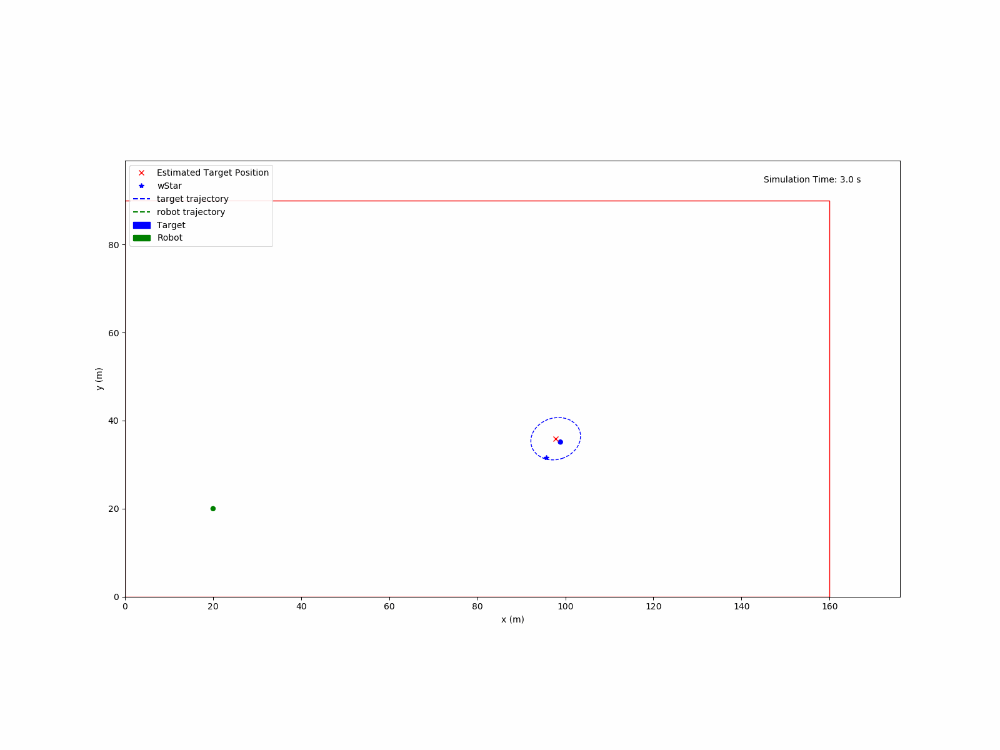

# Real Time Safe Control for Uncertain Goal State
#### By: Zachary Block, Amar Mohanty, and Harshil Parekh
Low quality sensors introduce significant noise to its measurements which can be problematic for safe
control when trying to follow a target moving non-linearly. The goal of this project is to develop an autonomous
system that can plan in real-time a safe trajectory to arrive to and follow a moving target when there is uncertainty
in the target’s state. With safety in mind, we propose a novel approach of estimating this uncertainty using a particle
filter to choose a point closest to the mean as the target. Additionally, we have developed an online trajectory planner
that fits a quintic spline along waypoints which utilizes a hybrid bang-bang controller with MPC. This approach
resulted in no collisions with a moving target and was able to follow the target better than traditional techniques
### Results
Robot following a target moving in a sinusoidal wave.

Robot following a target moving in a triangle shaped trajectory.

### Setup
To run this project:
1. Clone environment in your local environment
    1. I recommend using DeepNote because we will be using pydrake
2. Install prerequiste packages
3. Run the Notebook 1.ipynb which is the main script that configures and runs the simulator.

**Prerequisites: numpy, matplotlib, importlib, mpl_toolkits, pydrake, scipy**

**Project Architecture**

- Notebook 1.ipynb
  - Main script that runs the simulation
- Robot.py
  - Robot class which is the robot that we are controlling
- Target.py
  - Target class which is the target whose trajectory that we don't know
- Spline.py
  - Trajectory planner
